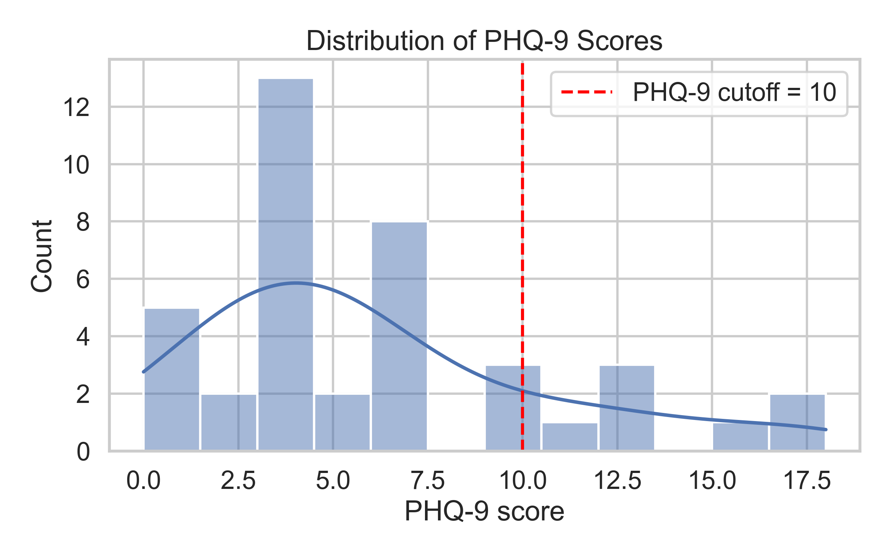
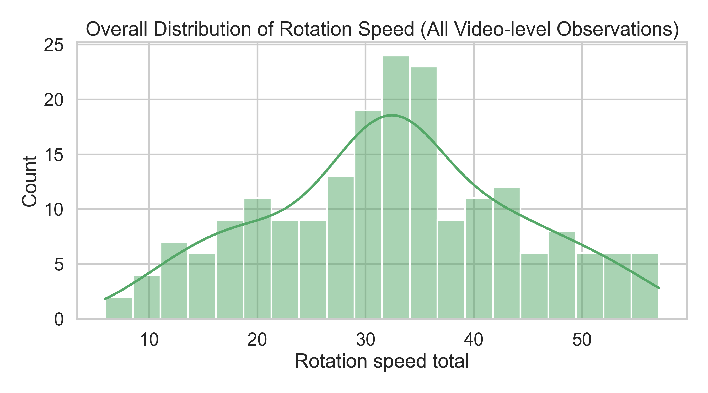
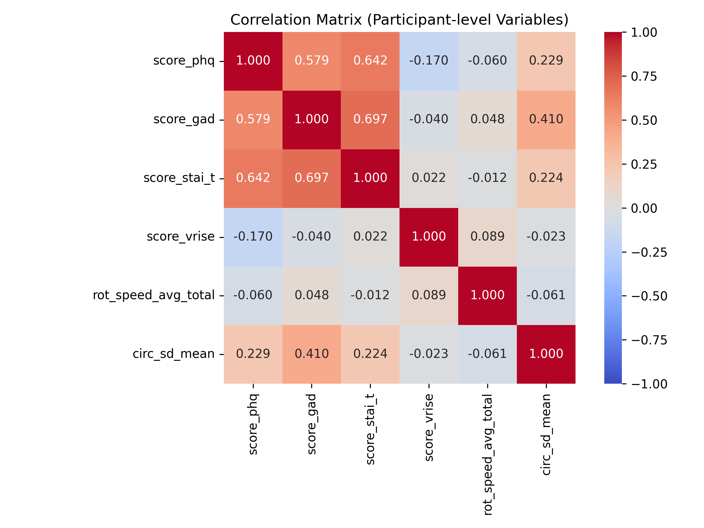
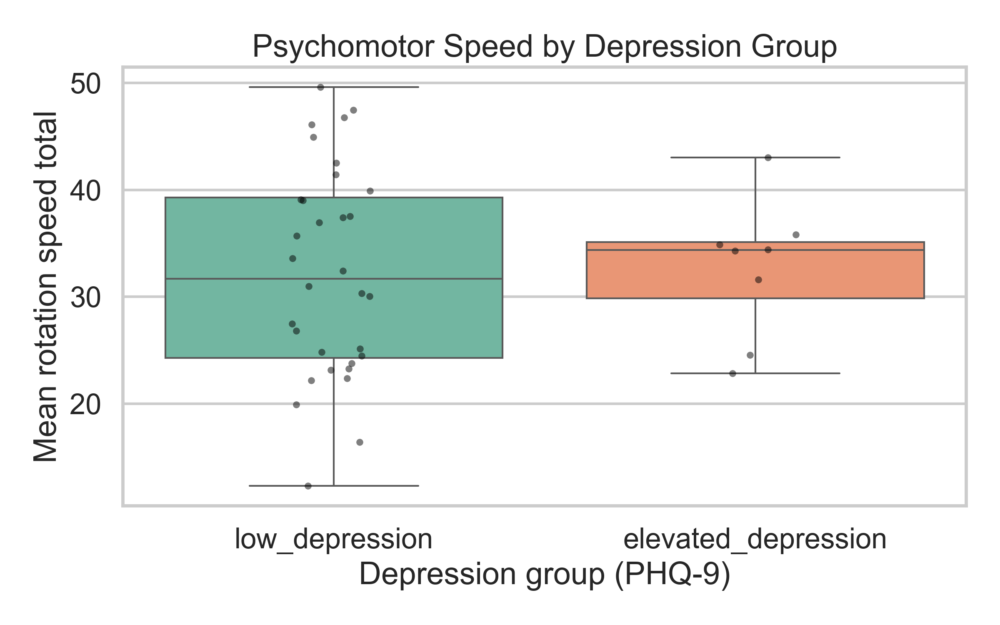
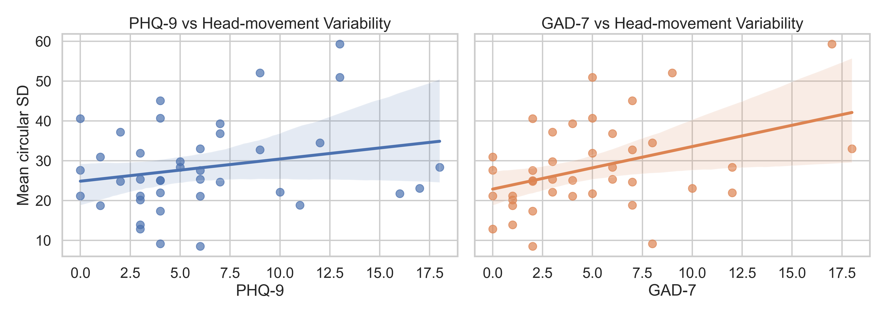
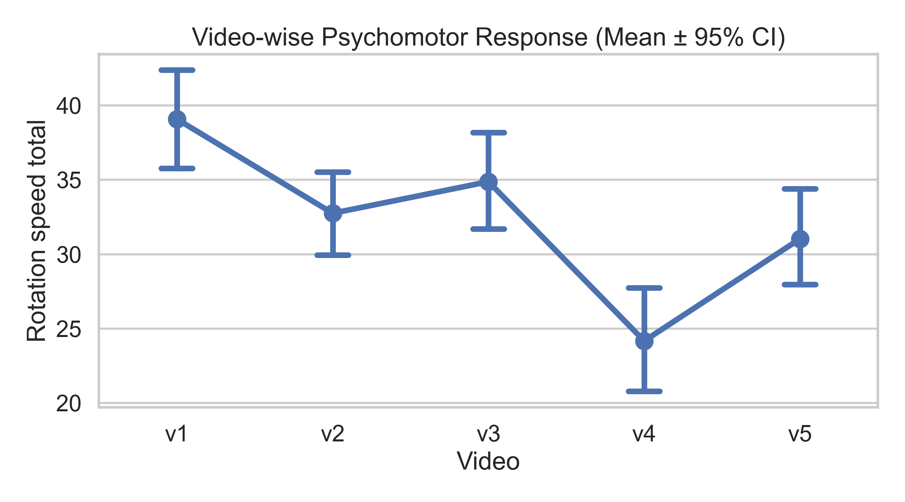

# Report 1: Are Headtracking Measures an Indicator of Depressive Symptoms?

## Team Members

- Priyanshu Sharma [2024201046]
- Amarnath Kumar [2024202024]
- Prakhar Kesari [2024202023]

## Repository
- [Github-Repository](https://github.com/ps600779/360-Videos-VR-Project)

## 1. Introduction

Depression is a widespread mental health condition that often involves persistent low mood, reduced interest in daily activities, and lower motivation. In addition to emotional symptoms, prior literature also describes behavioral changes such as psychomotor slowing, where movement becomes less frequent or less dynamic. Identifying measurable behavioral signatures of this pattern can support earlier screening and more objective monitoring of mental health status.

Virtual reality (VR) offers a useful setting for this type of measurement because it combines controlled stimulus presentation with high-resolution motion tracking. During immersive 360° content, headset sensors continuously capture head orientation and movement, including rotation-related behavior that can be summarized as speed and variability. These headtracking features provide a practical proxy for psychomotor response during naturalistic yet standardized tasks.

In this study, participants viewed multiple 360° VR videos while headtracking data were recorded, and they also completed psychological scales including PHQ-9 (depressive symptoms) and GAD-7 (anxiety symptoms). The main goal of this exploratory analysis is to test whether higher depressive symptom levels are associated with reduced head movement, and to examine this relationship while accounting for anxiety overlap and video-specific context effects.

The analysis scope:-

- data organization and unit of analysis,
- visualization and summarization,
- inferential hypothesis testing,
- probability/distribution assumptions,
- sampling-based inference,
- multiple-comparison correction.

### Dataset overview

- Source file: `data/data.xlsx`
- Participants: **40**
- Videos per participant: **5** (`v1` to `v5`)
- Total video-level observations: **200**
- Headtracking source files: `data/headtracking-data/v1 ... v5/*.csv`

Participant-level psychological measures include:
- `score_phq` (PHQ-9 depressive symptoms),
- `score_gad` (GAD-7 anxiety symptoms),
- `score_stai_t`, `score_vrise`, and affect variables.

Headtracking files provided per-video summary rows with:
- circular average position (X, Y, Z),
- circular SD position (X, Y, Z),
- average rotation speed (X, Y, Z, total).

This report uses **rotation speed total** as the primary psychomotor speed measure and the average of circular SD across X/Y/Z as a movement-variability measure.

### Hypotheses

- **H1 (Primary):** Participants with elevated depressive symptoms (PHQ-9 >= 10) will show lower mean head-movement speed than participants with low depressive symptoms.
- **H2:** Higher depressive symptom severity (continuous PHQ-9) will be associated with reduced psychomotor response (lower speed and lower movement variability).
- **H3:** Video context will significantly affect psychomotor response (rotation speed), indicating a within-subject video-type effect.

## 2. Methods

## 2.1 Data organization and preprocessing

Following slide guidance on data organization and unit of analysis:
- The primary inferential unit for depression analyses was **participant-level** (video means aggregated per participant).
- For video-type effects, the unit was **within-participant repeated observations** across five videos.

Processing steps:
1. Loaded `data.xlsx` and matched each participant’s `v1`–`v5` filename to corresponding headtracking CSV.
2. Extracted summary metrics from each CSV’s final line.
3. Built:
   - a long video-level table (`long_video_metrics.csv`),
   - a participant-level table (`participant_level_metrics.csv`).

## 2.2 Outlier identification and decision

As taught in data visualization/summarization slides, outliers were screened using the IQR rule (1.5 × IQR) on rotation speed total within each video.

- Outliers detected: **1** video-level point (in `v2`, value = 8.49).
- Decision: **Retained**.

Reasoning:
- It is a plausible behavioral value (not a data-entry artifact).
- Excluding a single valid low-response observation in a small sample (N=40) can bias effect estimates.
- Robustness is handled by reporting distributions and effect sizes, not only p-values.

## 2.3 Group partitioning for depression hypothesis

To create interpretable groups for the central hypothesis, participants were split using a standard PHQ-9 threshold:
- **Elevated depression**: PHQ-9 >= 10
- **Low depression**: PHQ-9 < 10

Group counts:
- Low depression: **32**
- Elevated depression: **8**

This preserves the hypothesis focus while remaining clinically interpretable.

## 2.4 Inferential strategy

1. **Descriptive statistics and visualization**
   - Histograms, box/strip plots, point plots with confidence intervals.

2. **Group hypothesis tests**
   - Independent-samples t-tests for elevated vs low depression groups on:
     - mean rotation speed total,
     - mean circular SD.
   - Effect size: Cohen’s d.

3. **Associations with symptom scales**
   - Pearson correlation of PHQ and GAD with psychomotor metrics.

4. **Reconciling depression–anxiety covariance**
   - Multiple linear regression with both PHQ and GAD entered simultaneously to estimate unique contributions.

5. **Video-type psychomotor differences**
   - Repeated-measures ANOVA across five videos for rotation speed total.
   - Post-hoc paired t-tests with **Bonferroni correction**.

Alpha was 0.05 unless otherwise stated.

## 3. Results

### 3.1 Descriptive overview

PHQ/GAD covariance was substantial:
- $r = 0.579$, $p < .001$

This confirms the expected overlap between depression and anxiety symptom scores.

### 3.1.1 Correlation matrix (participant-level variables)

To summarize linear relationships across key psychological and headtracking variables, a Pearson correlation matrix was computed for:
- PHQ-9 (`score_phq`)
- GAD-7 (`score_gad`)
- STAI-T (`score_stai_t`)
- VRISE (`score_vrise`)
- mean rotation speed total (`rot_speed_avg_total`)
- mean circular SD (`circ_sd_mean`)

| Variable | PHQ-9 | GAD-7 | STAI-T | VRISE | Speed | Variability |
|---|---:|---:|---:|---:|---:|---:|
| PHQ-9 | 1.000 | 0.579 | 0.642 | -0.170 | -0.060 | 0.229 |
| GAD-7 | 0.579 | 1.000 | 0.697 | -0.040 | 0.048 | 0.410 |
| STAI-T | 0.642 | 0.697 | 1.000 | 0.022 | -0.012 | 0.224 |
| VRISE | -0.170 | -0.040 | 0.022 | 1.000 | 0.089 | -0.023 |
| Speed | -0.060 | 0.048 | -0.012 | 0.089 | 1.000 | -0.061 |
| Variability | 0.229 | 0.410 | 0.224 | -0.023 | -0.061 | 1.000 |

Interpretation:
- Symptom scales cluster together (PHQ, GAD, STAI-T are positively intercorrelated).
- Speed has near-zero correlations with symptom variables.
- Variability has its strongest positive relationship with anxiety (GAD), which supports the regression finding in Section 3.3.

{width=50%}

{width=60%}

{width=60%}

### 3.2 Central hypothesis: depression and psychomotor response

#### A) Depression groups (PHQ-9 threshold)

**Mean rotation speed total**
- Elevated depression (n=8): 32.68
- Low depression (n=32): 32.31
- Independent-samples t-test: $t = 0.13$, $p = .898$, $d = 0.05$

**Mean circular SD (variability)**
- Elevated depression: 32.35
- Low depression: 27.17
- Independent-samples t-test: $t = 0.92$, $p = .381$, $d = 0.40$

Interpretation:
- No statistically significant group difference in psychomotor speed.
- Variability shows a small-to-moderate numeric increase in elevated depression, but not significant with current sample size.

{width=50%}

#### B) Continuous symptom associations

**PHQ correlations**
- PHQ vs speed: $r = -0.060$, $p = .712$
- PHQ vs variability: $r = 0.229$, $p = .155$

Interpretation:
- Depression severity does not show a reliable linear association with speed or variability in this sample.

### 3.3 Reconciling depression vs anxiety overlap

Regression with both PHQ and GAD as predictors:

**Outcome: speed**
- PHQ: $\beta = -0.263$, $p = .512$
- GAD: $\beta = 0.266$, $p = .536$
- $R^2 = .014$

**Outcome: variability**
- PHQ: $\beta = -0.031$, $p = .945$
- GAD: $\beta = 1.088$, $p = .029$
- $R^2 = .168$

Interpretation:
- After accounting for shared variance, **anxiety (GAD)**—not depression—shows a significant unique association with movement variability.
- This is an important conceptual result given the known covariance between anxiety and depression.

### 3.4 Do different videos elicit different psychomotor responses?

Video-wise speed means:
- V1: 39.08
- V2: 32.75
- V3: 34.87
- V4: 24.17
- V5: 31.03

Repeated-measures ANOVA:
- $F(4,156) = 34.58$, $p < .001$

Bonferroni-corrected pairwise results:
- Significant: V1>V2, V1>V3, V1>V4, V1>V5, V2>V4, V3>V4, V3>V5, V5>V4
- Non-significant after correction: V2 vs V3, V2 vs V5

Interpretation:
- Video context strongly changes head-movement speed.
- V4 (horror clip) produced the lowest speed on average, while V1 was highest.

Possible behavioral explanation (consistent with design/measurement framing from course):
- Different scene dynamics, emotional valence/arousal, attentional focus, and motor strategy demands likely drive distinct movement profiles.
- Psychomotor response in VR appears **stimulus-dependent**, not just trait-dependent.

{width=50%}

## 4. Replication judgment and additional insights

### Replication of original claim (depression → stunted psychomotor response)

Based on this sample and current metrics:
- The core depression-specific effect is **not clearly replicated**.
- Directional evidence for slower movement in higher depression is weak to absent.

### Additional insights beyond the original central question

1. Anxiety appears more tightly related to movement variability than depression when both are modeled together.
2. Video content has a strong and robust effect on psychomotor behavior.
3. Any future depression-linked effect should model content/context explicitly (video type as a major source of variance).

## 5. Conclusion and next steps

### Conclusion

Using only BRSM-taught concepts and methods, this analysis shows:
- No significant depression-group difference in head-movement speed,
- No strong PHQ-only linear effect,
- Significant anxiety-linked increase in movement variability (when controlling overlap),
- Strong and reliable video-dependent differences in psychomotor response.

### Practical next steps for Report 2

1. Keep H1 as the single confirmatory hypothesis and pre-register the exact test (independent-samples t-test on mean rotation speed), with H2/H3 treated as secondary.
2. Increase power for H1 with a larger and more balanced sample across depression groups, and report effect size + confidence interval + p-value together.
3. For H2 and H3, run the same planned association and repeated-measures tests with explicit assumption checks (distribution/outliers) before inference.
4. Maintain multiple-comparison correction for all post-hoc tests (Bonferroni/FDR) so support for hypotheses is statistically robust.

## 6. Team Contributions

- **Priyanshu Sharma:** Led project coordination, cleaned and merged participant-level and headtracking data, and drafted the Introduction/Conclusion sections.
- **Amarnath Kumar:** Implemented descriptive and inferential analyses (group tests, post-hoc comparisons) and verified statistical outputs.
- **Prakhar Kesari:** Prepared visualizations (distribution, group, video-wise, and correlation matrix plots), compiled Results interpretation, and finalized formatting/references.

## 7. References

- What Do Head Scans Reveal About Depression? Insights from 360° Psychomotor Assessment. (2025)
- Development and validation of brief measures of positive and negative affect: the PANAS scales. (1988)
- Validation of the Virtual Reality Neuroscience Questionnaire: Maximum Duration of Immersive Virtual Reality Sessions Without the Presence of Pertinent Adverse Symptomatology. (2019)
- Mental Health, Suicidality, Health, and Social Indicators Among College Students Across Nine States in India. (2024)
- PHQ-9 (standardized clinical resource)
- A brief measure for assessing generalized anxiety disorder: the GAD-7. (2006)
- State-Trait Anxiety Inventory (STAI)
- Measuring Presence in Virtual Environments: A Presence Questionnaire. (1998)
- A Circumplex model of Affect (Russell, 1980)
- The Critical Relationship Between Anxiety and Depression. (2020)
